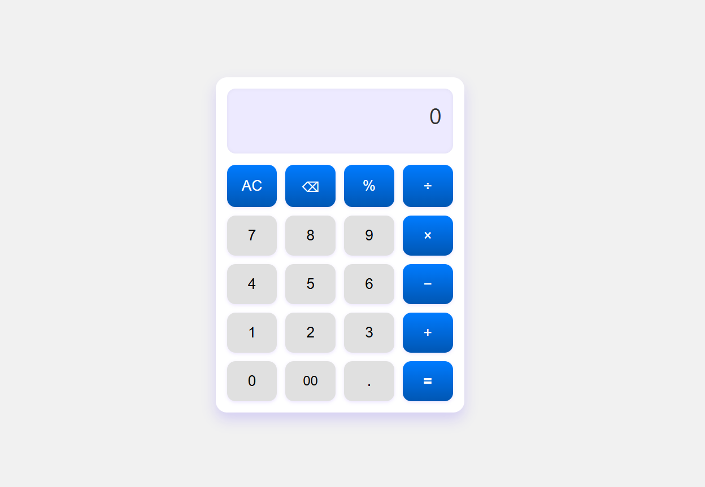

# calculator_tast_by_Selise
A basic calculator web app built with HTML, CSS, and JavaScript for learning front-end development.

# 🔢 Basic Calculator Web App

A clean, responsive, and professional-looking calculator built using pure HTML, CSS, and JavaScript. This calculator performs standard arithmetic operations with a sleek modern UI.

## ✨ Features

- Clean and modern user interface
- Supports basic operations: addition, subtraction, multiplication, division, and modulus
- Includes backspace (⌫), All Clear (AC), and "00" input
- Responsive layout with hover effects
- Purely built using HTML, CSS, and JavaScript (no libraries or frameworks)

## 💡 Technologies Used

- HTML
- CSS (with gradients and grid layout)
- Core JavaScript (DOM manipulation and expression evaluation)

